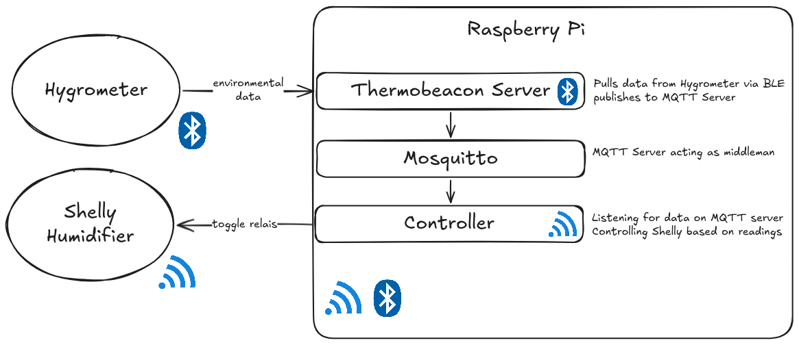

# Environment Control

Control a Shelly Smart Plug using environmental factors measured by a bluetooth hygrometer.



The Hygrometer is queried via the [Thermobeacon](https://github.com/StefanRichterHuber/Thermobeacon-server) server, which relays the readings to an MQTT server (Mosquitto).

The [Controller](./controller/) is listening on the MQTT server and uses the readings to control a Shelly Plug via HTTP.

A webserver is also exposing the measurements and a subset of the configuration.

## Setup

### Installation

[Install docker](https://docs.docker.com/engine/install/raspberry-pi-os/#install-using-the-repository) on your Raspberry Pi.

Additionally [install Docker Compose](https://docs.docker.com/compose/install/linux/#install-using-the-repository).

Clone this repository

```bash
git clone https://github.com/GerritPlehn/environment-control.git
cd environment-control
```

### Configuration

In `docker-compose.yml` change the `APP_DEVICES[0]_MAC` to correspond to your hygrometers bluetooth MAC. Refer to the official [Thermobeacon server docs](https://github.com/StefanRichterHuber/Thermobeacon-server?tab=readme-ov-file#configuration) for further info. Note that only 1 hygrometer is supported by this project.

Adapt the environment variables of `controller`

- `SHELLY_URL` Set to your Shelly's address, e.g. `http://10.20.0.41`
- `MODE` Either `VPD` or `HUMIDITY`, default: `VPD`
- `MAX_HUMIDITY` Humidity at which the Shelly will be turned off, default: `50`
- `MIN_HUMIDITY` Humidity at which the Shelly will be turned on, default: `40`
- `MAX_VPD` VPD at which the Shelly will be turned off, default: `1.2`
- `MIN_VPD` VPD at which the Shelly will be turned on, default: `0.8`
- `CHECK_INTERVAL_SEC` Interval at which the controller checks the latest MQTT message, default: `60`
- `VPD_RESPECT_MAX_HUMIDITY` Only relevant when `MODE` is set to `VPD`. If set to `true` `MAX_HUMIDITY` will still be respected, default `false`

### First run

Change the configuration as mentioned above, then for initial setup run

```bash
docker compose up
```

You'll see a lot of log output on your screen that will be helpful for eventual troubleshooting.

Verify functionality (check the API on `http://YOUR_PI_IP:3000`), terminate the process with `Ctrl+C` if you need to do changes to the configuration or have finished setup.

### Regular Use

Run the utility with

```bash
docker compose up -d
```

If you need to inspect the logs

```bash
docker compose logs --since=1h -f
```

To stop the process

```bash
docker compose down
```
