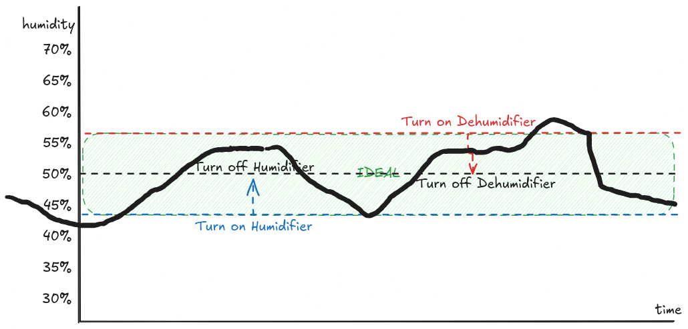

# Environment Control

Control a Shelly Smart Plug using environmental factors measured by a bluetooth hygrometer.


The Hygrometer is queried via the [Thermobeacon](https://github.com/StefanRichterHuber/Thermobeacon-server) server, which relays the readings to an MQTT server (Mosquitto).

The [Controller](./controller/) is listening on the MQTT server and uses the readings to control a Shelly Plug via HTTP.

A webserver is also exposing the measurements and a subset of the configuration.

## Setup

### Installation

[Install docker](https://docs.docker.com/engine/install/raspberry-pi-os/#install-using-the-repository) on your Raspberry Pi.

Additionally [install Docker Compose](https://docs.docker.com/compose/install/linux/#install-using-the-repository).

Clone this repository

```bash
git clone https://github.com/GerritPlehn/environment-control.git
cd environment-control
```

It is also highly recommended to add a [dead man's switch](https://en.wikipedia.org/wiki/Dead_man%27s_switch) as a script to your Shelly to ensure that the outlet is turned off when the controller goes offline. While the controller tries to switch off the outlet when the controller shuts down, an unexpected crash might occur anyways.

```js
function checkStatus() {
  Shelly.call(
    'http.get',
    { url: 'http://[your-controller-ip]:3000' },
    function (res, error_code) {
      if (error_code || res.code !== 200) {
        Shelly.call('Switch.Set', { id: 0, on: false });
      }
    }
  );
}

// check every 60 seconds
Timer.set(60000, true, checkStatus);
```

### Configuration

In `docker-compose.yml` change the `APP_DEVICES[0]_MAC` to correspond to your hygrometers bluetooth MAC. Refer to the official [Thermobeacon server docs](https://github.com/StefanRichterHuber/Thermobeacon-server?tab=readme-ov-file#configuration) for further info. Note that only 1 hygrometer is supported by this project.

Adapt the environment variables of `controller`

- `HUMIDIFIER_SHELLY_URL` Set to your humidifier's Shelly address, e.g. `http://10.20.0.41` (optional)
- `DEHUMIDIFIER_SHELLY_URL` Set to your dehumidifier's Shelly address, e.g. `http://10.20.0.42` (optional)
- `MODE` Either `VPD` or `HUMIDITY`, default: `VPD`
- `MAX_HUMIDITY` Humidity at which the Shelly will be turned off, default: `50`
- `MIN_HUMIDITY` Humidity at which the Shelly will be turned on, default: `40`
- `MAX_VPD` VPD at which the Shelly will be turned on, default: `1.2`
- `MIN_VPD` VPD at which the Shelly will be turned off, default: `0.8`
- `CHECK_INTERVAL_SEC` Interval at which the controller checks the latest MQTT message, default: `60`
- `VPD_RESPECT_MAX_HUMIDITY` Only relevant when `MODE` is set to `VPD`. If set to `true` `MAX_HUMIDITY` will still be respected, default `false`
- `MIN_SWITCH_TIME` Minimum minutes that need to have passed in order to switch again, default: `0`
- `LEAF_TEMP_OFFSET` Offset for the leaf temperature in Kelvin, default: `-2`

### First run

Change the configuration as mentioned above, then for initial setup run

```bash
docker compose up
```

You'll see a lot of log output on your screen that will be helpful for eventual troubleshooting.

Verify functionality (check the API on `http://YOUR_PI_IP:3000`), terminate the process with `Ctrl+C` if you need to do changes to the configuration or have finished setup.

## Usage

Run the utility with

```bash
docker compose up -d
```

If you need to inspect the logs

```bash
docker compose logs --since=1h -f
```

To stop the process

```bash
docker compose down
```

## Functionality

The controller has the ability to control up to 2 devices: a humidifier and a dehumidifier.



When the MAX value of the selected mode is exceeded, the device used for lowering the value is turned on.

When the MIN value of the selected mode is exceeded, the device used for increasing the value is turned on.

The respective device is turned off once the mid-point between MIN and MAX value is reached, in order to avoid having both devices working against each other constantly.

As an example: When operating in `HUMIDITY` mode with a MIN of 45% and a MAX of 55%, the humidifier will be turned on when the humidity is below 45% and will then be turned off after it reaches 50% ((45%+55%)/2).

When the humidity exeeds 55%, the dehumidifier will be turned on and turned off after it reaches 50% yet again.
